# Java AI Agents with Spring AI

Production-ready AI agent built with **Spring AI**, **Amazon Bedrock**, **PostgreSQL**, **PgVector**, and **AWS infrastructure** including **EKS**, **ECS**, and **Cognito**.

This repository demonstrates how to build a full AI agent system including:

• LLM integration  
• conversational memory  
• retrieval augmented generation (RAG)  
• tool calling  
• Model Context Protocol (MCP)  
• authentication with Cognito  
• deployment on Kubernetes and ECS  

The project was developed during the **DevNexus Spring AI Workshop**.

---

# Architecture Overview

The system follows a modular AI agent architecture.

```

User
│
│ HTTP Request
▼
AI Agent (Spring Boot)
│
├── Amazon Bedrock LLM
│
├── PostgreSQL
│     ├── Chat Memory
│     └── PgVector Embeddings
│
├── Tools
│     ├── Weather API
│     └── DateTime Tool
│
└── MCP Client
│
▼
MCP Server
│
▼
Unicorn Store Service

```
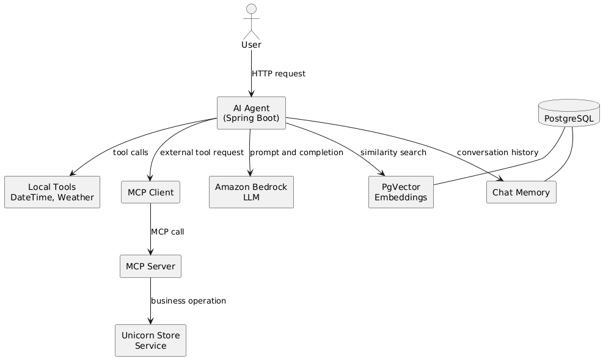

---

# Project Structure

```

aiagent/
│
├── src/main/java/com/example/agent
│     ├── ChatService.java
│     ├── InvocationController.java
│     ├── DateTimeTools.java
│     ├── WeatherTools.java
│     ├── SecurityConfig.java
│
├── resources
│     ├── application.properties
│     └── static/
│
└── pom.xml

```

Separate repository/module:

```

mcpserver/
│
├── UnicornTools.java
├── application.yaml
└── pom.xml

````

---

# Core Technologies

| Technology | Purpose |
|---|---|
Spring Boot | Application framework |
Spring AI | AI integration layer |
Amazon Bedrock | LLM provider |
PostgreSQL | relational database |
PgVector | vector storage |
Amazon Cognito | authentication |
Amazon EKS | Kubernetes deployment |
Amazon ECS | container deployment |
MCP | tool communication protocol |

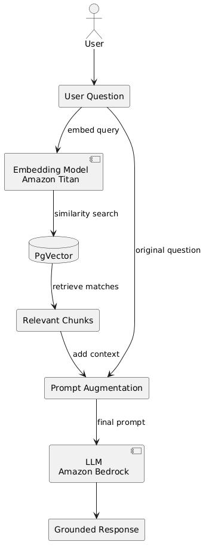

---

# Key Concepts

## AI Agent

An AI agent is a service that combines:

- an LLM
- memory
- knowledge base
- tools
- external systems

Spring AI simplifies this architecture using advisors and clients.

---

# ChatClient

`ChatClient` is the central interface used to interact with LLMs.

Example:

```java
chatClient.prompt()
    .user(prompt)
    .stream()
    .content();
````

It abstracts the model provider.

Switching providers only requires configuration changes.

---

# Agent Persona

Agents should behave according to a defined role.

This is implemented using a **system prompt**.

Example:

```java
.defaultSystem("""
You are an AI assistant for Unicorn Rentals.
Be friendly and helpful.
""")
```

The system prompt controls tone, constraints, and domain knowledge.

---

# Conversation Memory

LLMs do not remember previous messages.

Spring AI introduces **ChatMemory** to maintain conversation history.

This project uses:

```
JdbcChatMemoryRepository
```

which stores messages in PostgreSQL.

Memory configuration example:

```
spring.ai.chat.memory.repository.jdbc.initialize-schema=always
```

---

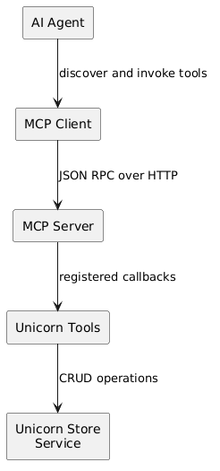

# Retrieval Augmented Generation (RAG)

RAG allows the model to access external knowledge.

Instead of relying only on training data, the model retrieves documents from a knowledge base.

### RAG Workflow

```
User Question
      │
      ▼
Embedding Model
      │
      ▼
Vector Database (PgVector)
      │
      ▼
Relevant Documents
      │
      ▼
Prompt Augmentation
      │
      ▼
LLM Response
```

---

## Vector Database

This project uses **PgVector with PostgreSQL**.

Configuration:

```
spring.ai.vectorstore.pgvector.initialize-schema=true
spring.ai.vectorstore.pgvector.dimensions=1024
```

Embeddings are generated using **Amazon Titan Embedding Model**.

---

# Tool Calling

LLMs cannot access real-time information.

Tool calling enables the model to invoke Java functions.

Example tool:

```java
@Tool
public String getCurrentDateTime(String timeZone) {
    return ZonedDateTime.now().toString();
}
```

Tools implemented in this project:

| Tool          | Description                   |
| ------------- | ----------------------------- |
| DateTimeTools | returns current date and time |
| WeatherTools  | retrieves weather forecasts   |

---

# Model Context Protocol (MCP)

MCP is an open protocol allowing AI systems to interact with external tools.

Architecture:

```
AI Agent (Client)
        │
        ▼
MCP Server
        │
        ▼
External Services
```

The MCP server exposes tools such as:

* create unicorn
* list unicorns

The AI agent automatically discovers these tools.

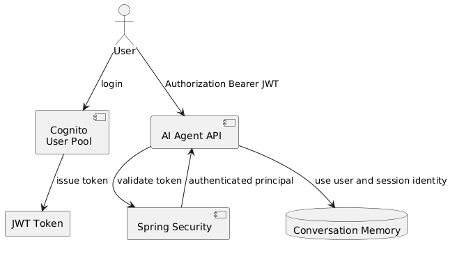

---

# Security

Authentication is handled using **Amazon Cognito**.

Security flow:

```
User Login
   │
   ▼
Cognito User Pool
   │
   ▼
JWT Token
   │
   ▼
Spring Security Validation
   │
   ▼
AI Agent Access
```

Configuration example:

```
spring.security.oauth2.resourceserver.jwt.issuer-uri=${COGNITO_ISSUER_URI}
```

---

# Running Locally

Start the application:

```
./mvnw spring-boot:run
```

Test endpoint:

```
POST /invocations
```

Example request:

```
curl -X POST localhost:8080/invocations \
  -H "Content-Type: application/json" \
  -d '{"prompt":"Hello"}'
```

---

# Loading Knowledge for RAG

Documents can be added to the vector database.

Endpoint:

```
POST /load
```

Example:

```
curl -X POST localhost:8080/load \
  -H "Content-Type: text/plain" \
  -d "Unicorns appear in Chinese, Greek, and Indian mythology"
```

---

# Deployment

## Kubernetes (Amazon EKS)

Deployment components:

| Resource     | Purpose             |
| ------------ | ------------------- |
| Deployment   | manages pods        |
| Service      | internal networking |
| Ingress      | load balancer       |
| Pod Identity | AWS permissions     |

Secrets are mounted using:

```
Secrets Store CSI Driver
```

---

# Container Build

Images are built using **Jib**.

Example:

```
mvn compile jib:build
```

Images are pushed to **Amazon ECR**.

---

# ECS Deployment

The AI agent can also run on **Amazon ECS Fargate**.

Workflow:

```
Build Image
    │
Push to ECR
    │
Update ECS Service
    │
Deployment
```

Logs are available in **CloudWatch Logs**.

---

# Example Usage

Example conversation:

```
User: My name is Nayab
AI: Nice to meet you Nayab.

User: What is my name?
AI: Your name is Nayab.
```

Example tool usage:

```
User: What is the weather tomorrow in Las Vegas?
AI: Weather for Las Vegas on 2026-03-07: Min 10°C, Max 18°C
```

---

# Learning Outcomes

This project demonstrates:

• building AI agents in Java
• integrating LLMs with Spring Boot
• implementing conversation memory
• building RAG systems
• connecting external tools with MCP
• securing AI APIs with Cognito
• deploying AI services on AWS infrastructure

---

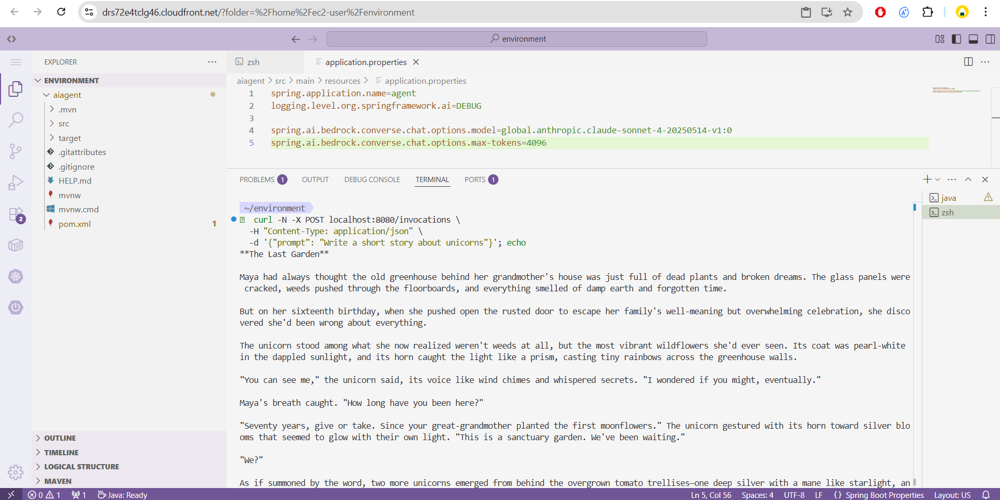
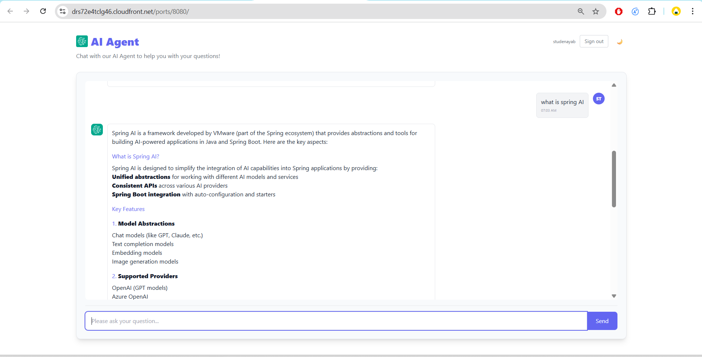
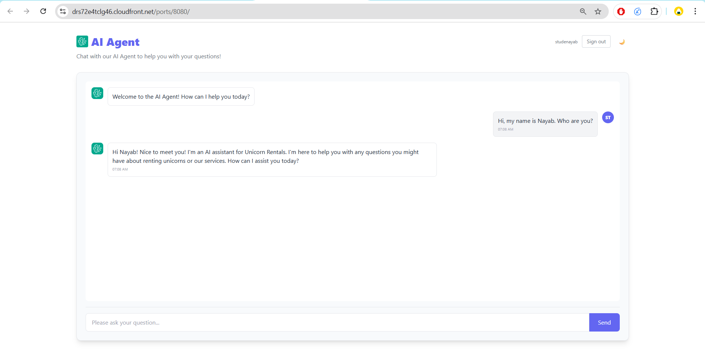
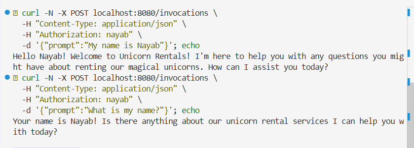
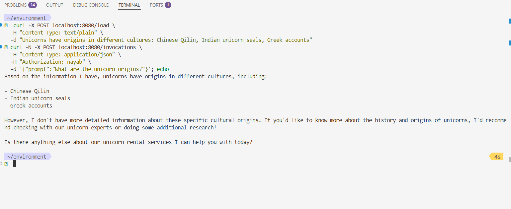
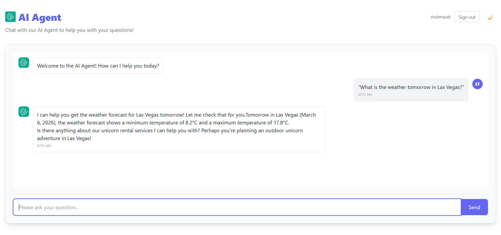
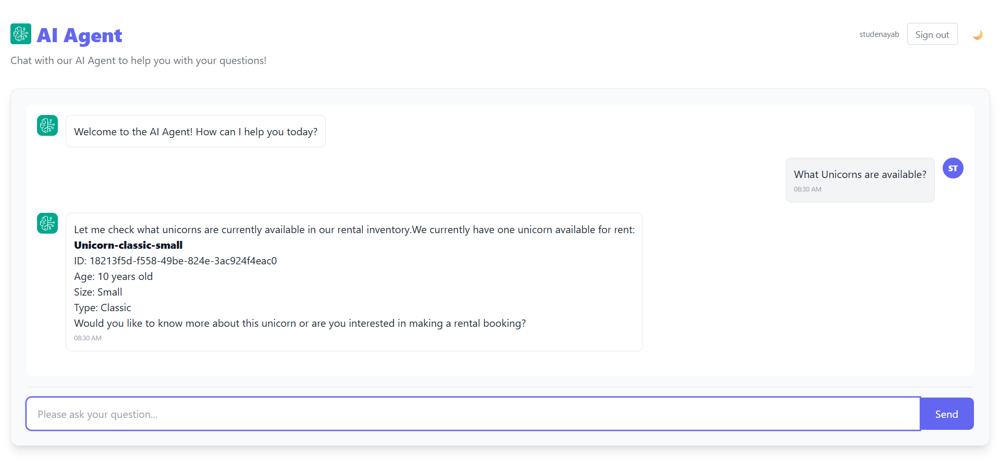
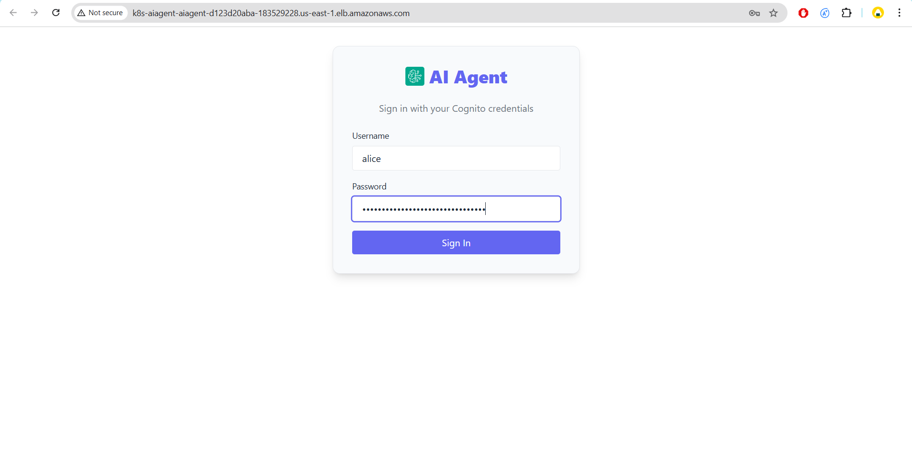
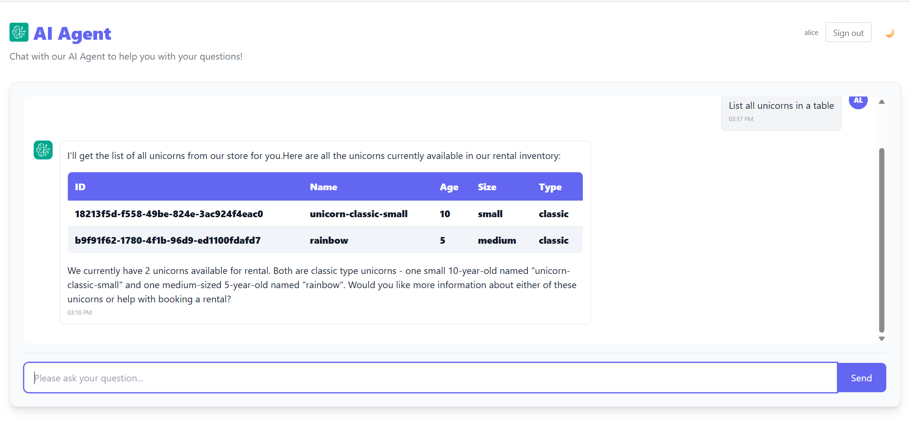
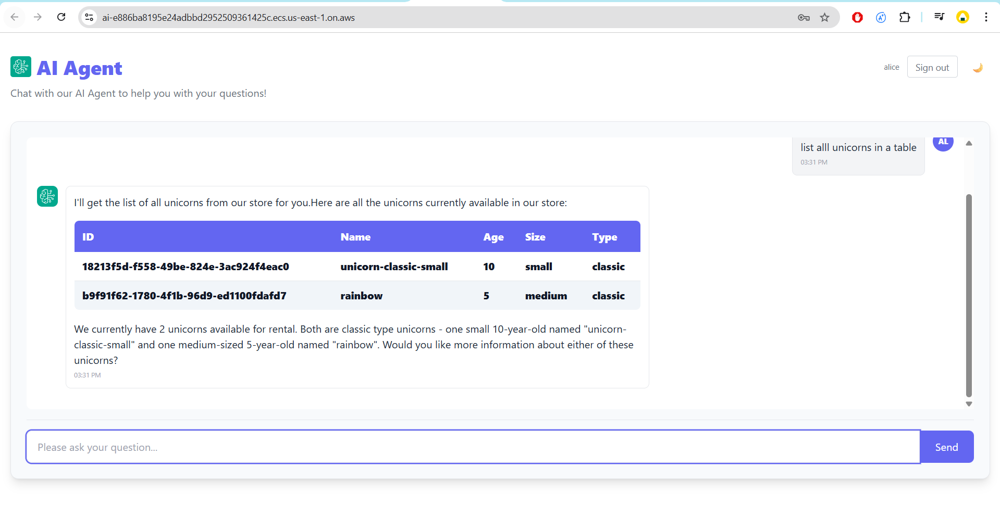

# Future Improvements

Potential extensions:

• multi-agent orchestration
• workflow automation
• document ingestion pipelines
• observability dashboards
• model switching between providers

---
